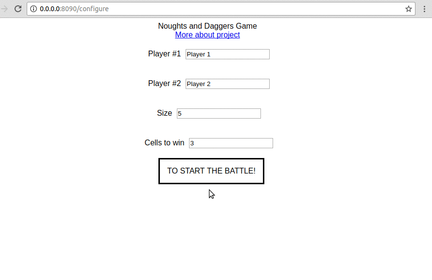

# Tic-tac-toe


[](https://coveralls.io/github/dmitrymalakhov/noughtsanddaggers?branch=master)

A simple implementation of the game "TIC TAC toe" using React, animation routes with React Router v4 and Styled Components and ImmutableJS, GraphQL, Apollo, Jest, Storybook and a little magic.



## Getting started

```
yarn install
yarn start
```

Open your browser to 0.0.0.0:8090

## Plans for the near future
More and more hype-driven development.
Add Flow, GraphQL Subscription, SSR, React Native implementation.

Would be cool, if you write to me about non compliance the best practices of programming in stack of React.

If my code help you, please click ★. This will give me the strength to add more technology in project.
